# Landmarks Classification & Tagging using CNN 


### Classify/tag a given image of famous landmark using CNN (Convolutional Neural Network)


## Table of Contents

- [Introduction](#introduction) 
- [Objective](#objective)
- [Dataset](#dataset)
- [Evaluation Criteria](#evaluation-criteria)
- [Solution Approach](#solution-approach)
- [How To Use](#how-to-use)
- [Credits](#credits)
- [License](#license)
- [Author Info](#author-info)


## Introduction
Photo sharing and photo storage services like to have location data for each photo that is uploaded. With the location data, these services can build advanced features, such as automatic suggestion of relevant tags or automatic photo organization, which help provide a compelling user experience. Although a photo's location can often be obtained by looking at the photo's metadata, many photos uploaded to these services will not have location metadata available. This can happen when, for example, the camera capturing the picture does not have GPS or if a photo's metadata is scrubbed due to privacy concerns.

If no location metadata for an image is available, one way to infer the location is to detect and classify a discernible landmark in the image. Given the large number of landmarks across the world and the immense volume of images that are uploaded to photo sharing services, using human judgment to classify these landmarks would not be feasible. In this project we'll try to address this problem by building `Neural Network` (NN) based models to automatically predict the location of the image based on any landmarks depicted in the image.

---
## Objective
To build a NN based model that'd accept any user-supplied image as input and suggest the `top k` most relevant landmarks from `50 possible` landmarks from across the world. 

1. Download the dataset 
2. Build a CNN based neural-network, from Scratch, to classify the landmark image
   - Here we aim to attain a test accuracy of at least 30%. At first glance an accuracy of 30% may appear to be very low but its way better than random guessing, which would provide an accuracy of just 2% since we have 50 different landmarks classes in the dataset.
3. Build a CNN based neural-network, using transfer-learning, to classify the landmark image
    - Here we aim to attain a test accuracy of at least 60% which is pretty good given the complex nature of this task.
4. Implement inference function which will accepts a file-path to an image and an integer k, and then predicts the top k most likely landmarks this image belongs to. The image below displays an expected sample output from the predict function where it has predicted top 3 (k = 3) possibilities for the image in question.


---
## Dataset
- Dataset to be downloaded from [here](https://udacity-dlnfd.s3-us-west-1.amazonaws.com/datasets/landmark_images.zip). Note that this is a mini dataset containing around 6,000 images), this dataset is small subset of the [Original Landmark Dataset](https://github.com/cvdfoundation/google-landmark) that contains over 700,000 images.
- Unzipped dataset would have the parent folder `landmark_images` containing training data in `train` sub-folder and testing data in `test` sub-folder
- There are 1250 images in `test` sub-folder, to be kept hidden and only used for model evaluation
- There are 4996 images in `train` sub-folder, to be used for training and validation
- Images in `test` and `train` sets are further categorized and kept in one of the 50 sub-folders representing 50 different landmarks classes (from 0 to 49)
- Images in the dataset are of different sizes and resolution
- Here are few samples from the training dataset with their respective labels descriptions...

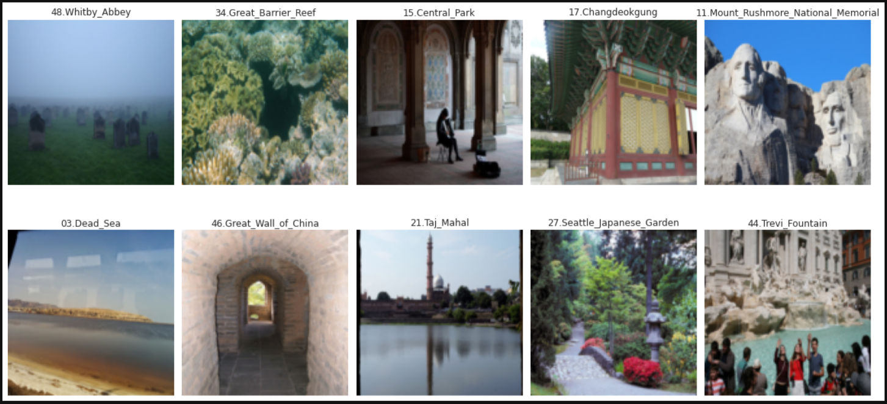


---

## Evaluation Criteria

### Loss Function  
We are going to use `LogSoftmax` in the output layer of the network...

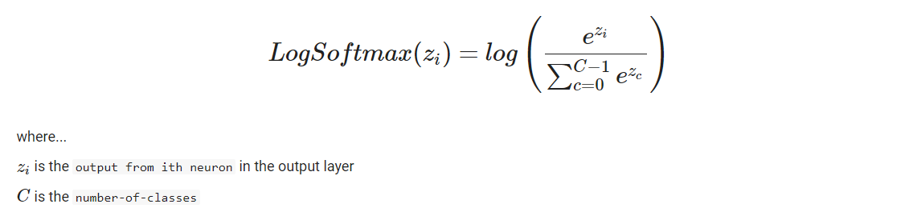

Now we need a suitable loss-function that consumes these `log-probabilities` outputs and produces a total loss. The function that we are looking for is `NLLLoss` (Negative Log Likelyhood Loss). In practice `NLLLoss` is nothing but a generalization of `BCELoss` (Binary Cross EntropyLoss or Log Loss) extended from binary-class to multi-class problem.

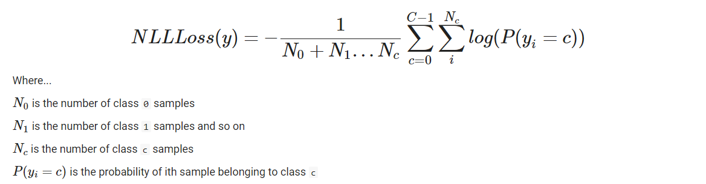

<br>Note the `negative` sign in front `NLLLoss` formula hence negative in the name. Negative sign is put in front to make the overall average loss positive. If we don't do this then, since `log` of a number less than 1 is negative, we will end-up with negative overall average loss which means in order to reduce the loss we need to `maximize` the loss function instead of `minimizing` which is a much easier task mathematically than `maximizing`.


### Performance Metric

`accuracy` is used as the model's performance metric on the test-set 

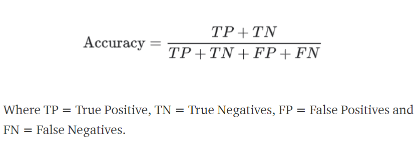

---
## Solution Approach
- Once the dataset is downloaded and unzipped we split the training set in to training and validation sets in 80%:20% (3996:1000) ratio and keep images in respective `train` and `val` sub-folders.
- `train` data is then used to build Pytorch `Dataset` object after applying data-augumentations, images are resized to 128x128.
- `mean` and `standard deviation` is then computed for train dataset and then dataset is `normalized` using the computed statistics. 
- The RGB channel histogram of train set is shown below...

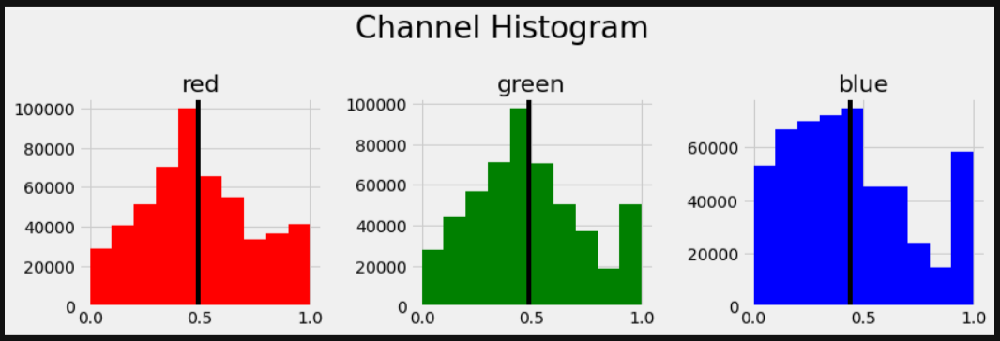

- The RGB channel histogram of train set after normalization is shown below...

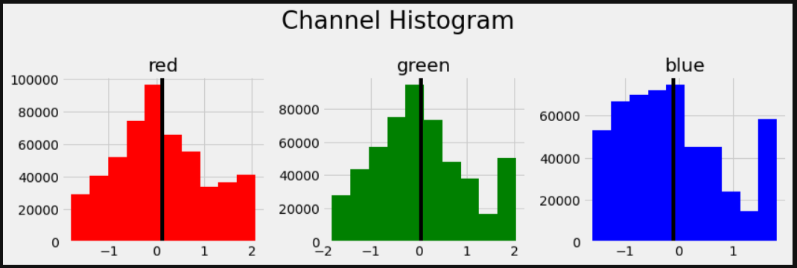

- Now, `test` and `val` Dataset objects are prepared in same fashion where images are resized to 128x128 and then normalized.
- The training, validation and testing datasets are then wrapped in Pytorch `DataLoader` object so that we can iterate through them with ease. A typical `batch_size` 32 is used.

### CNN from scratch
- The neural network is implemented as a subclass of `nn.Module` PyTorch class. The final network presented here is build incrementally with many experiments...
    - Started with very small CNN of just 2 convolutions and a linear layer with LogSoftmax output. 
    - Tried to overfit the network on a single batch of 32 training images but network found it hard to overfit which means its not powerful enough. 
    - Gradually increased the Conv and Linear layers to easily overfit the batch. 
    - Then trained on full training data, adjusted layers and output sizes to ensure that training loss goes down. 
    - Then trained again with validation data to select the best network with lowest validation loss.
    - `ReLU` is used as activation function and `BatchNorm` used after every layer except the last.
    - Final model architecture (from scratch) is shown below...
    
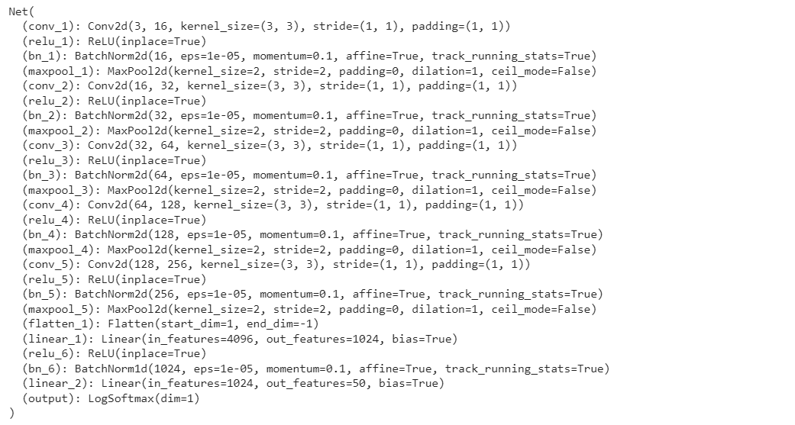    

- Network initial weights are initialized by numbers drawn from a `normal-distibution` in range... 

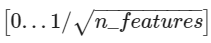

- Network is then trained and validated for 15 epochs using `NLLLoss` function and `Adam` optimizer with a learning rate of 0.001. We save the trained model here as `ignore.pt` (ignore because we are not really using it for evaluation)
- We keep track of training and validation losses. When plotted we observe that model starts to `overfit` very quickly.

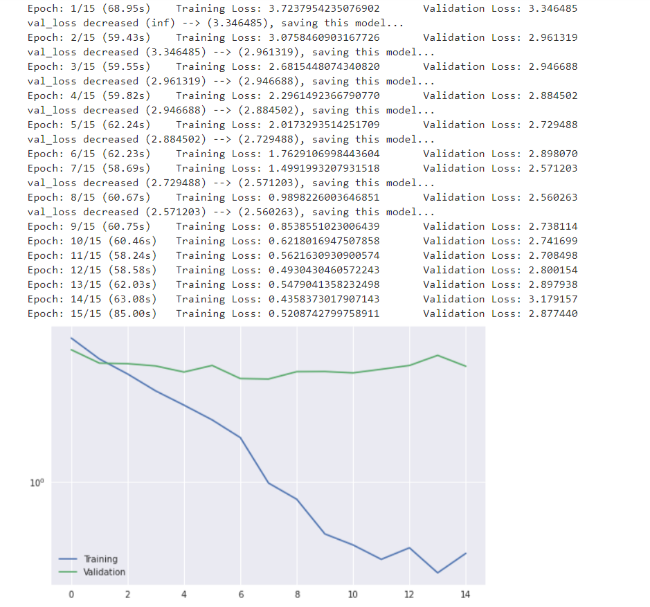

- Now, we reset the Network initial weights to Pytorch default weight to check if there are any improvements 
- Network is then again trained and validated for 15 epochs using `NLLLoss` function and `Adam` optimizer with a learning rate of 0.001. We save the trained model here as `model_scratch.pt` (we will use this saved model for evaluation)
- We keep track of training and validation losses. When plotted we observe that result is almost same as that of custom weight initialization

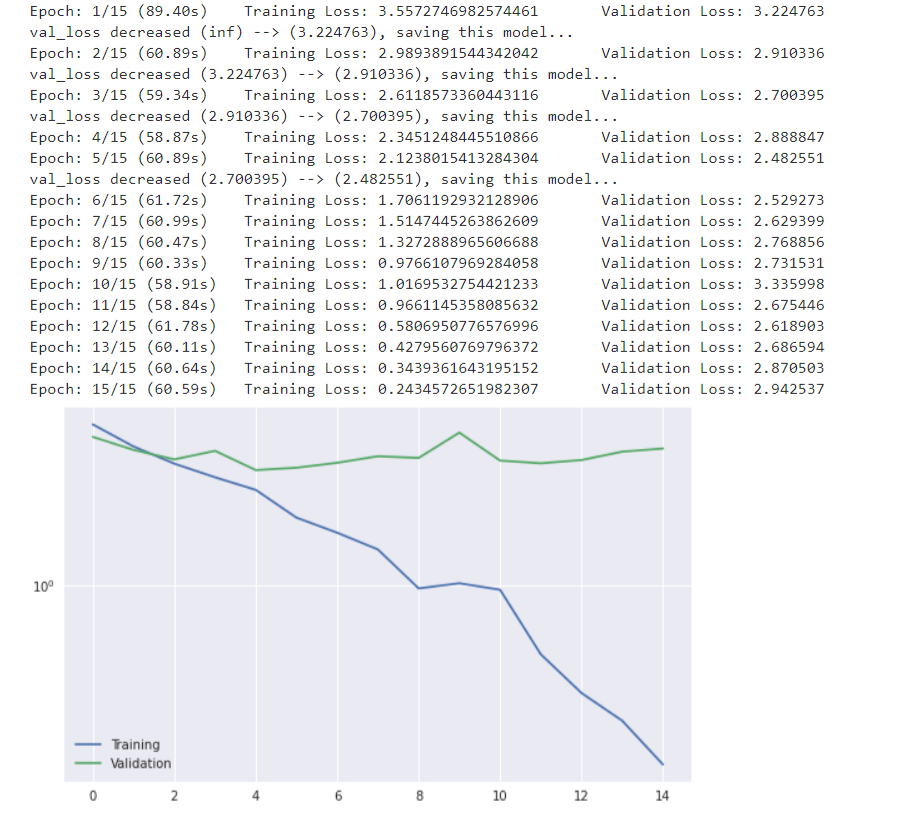

- The trained network (`model_scratch.pt`) is then loaded and evaluated on unseen 1,250 testing images.
- Network is able to achieve around `38%` accuracy, which is more than what we aimed for (i.e. 30%). Network is able to classify `475` images out of total `1250` test images.

### CNN using transfer-learning
- Here we use transfer-learning to implement the CNN network to classify images of landmarks.  
    - We have selected the `VGG19` pre-trained model on `ImageNet` as our base model.
    - Models pre-trained and tested on ImgaeNet are extremely capable of extracting general features from even the datasets that may not be very similar to ImageNet. This is due to the sheer size of ImageNet dataset (1.2 million images) and number of classes (1000). Instead of `VGG19` we could have chosen `ResNet`, `DenseNet`  as our base network they would have worked just fine. `VGG19` was selected here because of its simplicity of architecture and still producing an impressive result.
    - VGG19 models weights are frozen so that they do not change during the training. 
    - A `custom-classifier` with `ReLU` activation, `Dropouts` in hidden layers and `LogSoftmax` in last layer is created.
    - The original classifier layer in VGG19 is then replaced by `custom-classifier` that has learnable weights.
    - Final model architecture (transfer learning) is shown below...
    
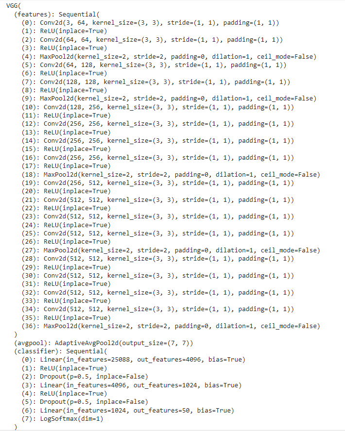    

- Network is then trained and validated for 10 epochs using `NLLLoss` function and `Adam` optimizer with a learning rate of 0.001. Note that optimizer has been supplied with the learnable parameters of `custom-classifier` only and not the whole model. This is because we want to optimize our custom-classifier weights only and use ImageNet learned weights for rest of the layers.
- We keep track of training and validation losses and plot them. 

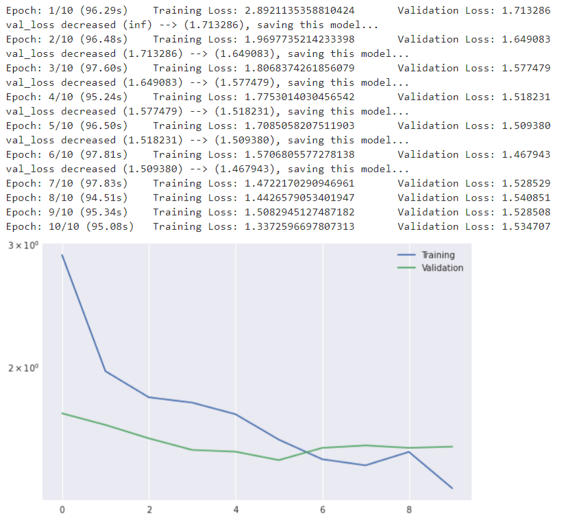

- Trained network is saved as `model_transfer.pt` 

- The trained network `model_transfer.pt` is then loaded and evaluated on unseen 1,250 testing images.
- This time network is able to achieve around `63%` accuracy, which is more than what we aimed for (i.e. 60%). Network is able to classify `788` images out of total `1250` test images.
- As we can see that the model built using transfer learning has outperformed the model built from scratch hence the second model will be used for making prediction on unseen images.

### Interface for inference 
- In order for our model to be used easily we'll implement a function `predict_landmarks` which will... 
    - Accepts a `file-path` to an image and an integer `k`
    - Function expects the trained model `model_transfer.pt` to be present in same folder/directory from where function is being invoked. The trained model can be downloaded from [here](https://drive.google.com/file/d/1c3aj2l3f3mkuH2a9orFDRNPdg0Vqa-wg/view?usp=sharing)
    - It predicts and return the **top k most likely landmarks**. 
    - `predict_landmarks` function can be invoked from `python` script or shell, an example is shown below...
    
    
    ```python
         >>> predicted_landmarks = predict_landmarks('images/test/09.Golden_Gate_Bridge/190f3bae17c32c37.jpg', 5)
         >>> print(predicted_landmarks)
         ['Golden Gate Bridge',
          'Forth Bridge',
          'Sydney Harbour Bridge',
          'Brooklyn Bridge',
          'Niagara Falls']
    ```
    
- We create another higher-level function `suggest_locations` that accepts same parameters as that of `predict_landmarks` and internally uses `predict_landmarks` function
- A sample of function usage and its output is shown below

``` python
    >>> suggest_locations('assets/Eiffel-tower_night.jpg')
```

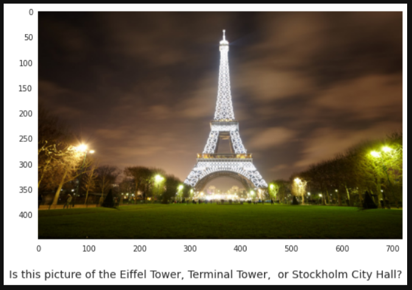
    
---
## How To Use
1. Ensure below listed packages are installed
    - `numpy`
    - `matplotlib`
    - `torch`
    - `torchvision`
    - `cv2`
    - `PIL`
2. Download `landmark-classification-cnn-pytorch.ipynb` jupyter notebook from this repo
3. In order to train the models, its recommended to execute the notebook one cell at a time. If a GPU is available (recommended) then it'll use it automatically else it'll fall back to CPU. 
4. On a machine with `NVIDIA Quadro P5000` GPU with 16GB memory it approximately takes 15-18 minutes to train and validate the `from scratch` model for 15 epochs
5. On a machine with `NVIDIA Quadro P5000` GPU with 16GB memory it approximately takes 15-18 minutes to train and validate the `transfer-learning` model for 10 epochs
6. A fully trained model `model_transfer.pt` can be downloded from [here](https://drive.google.com/file/d/1c3aj2l3f3mkuH2a9orFDRNPdg0Vqa-wg/view?usp=sharing). This model then can be used directly for tagging new landmark images as described in [Interface for inference](#interface-for-inference) section. 

---
## Credits
- Dataset used in this project is provided by [Udacity](https://www.udacity.com/)
- Above dataset is a subset taken from the original landmarks dataset by Google [Original Landmark Dataset](https://github.com/cvdfoundation/google-landmark)
- Title photo by [Patty Jansen On Pixabay](https://pixabay.com/users/pattyjansen-154933/)

---
## License

MIT License

Copyright (c) [2021] [Sunil S. Singh]

Permission is hereby granted, free of charge, to any person obtaining a copy
of this software and associated documentation files (the "Software"), to deal
in the Software without restriction, including without limitation the rights
to use, copy, modify, merge, publish, distribute, sublicense, and/or sell
copies of the Software, and to permit persons to whom the Software is
furnished to do so, subject to the following conditions:

The above copyright notice and this permission notice shall be included in all
copies or substantial portions of the Software.

THE SOFTWARE IS PROVIDED "AS IS", WITHOUT WARRANTY OF ANY KIND, EXPRESS OR
IMPLIED, INCLUDING BUT NOT LIMITED TO THE WARRANTIES OF MERCHANTABILITY,
FITNESS FOR A PARTICULAR PURPOSE AND NONINFRINGEMENT. IN NO EVENT SHALL THE
AUTHORS OR COPYRIGHT HOLDERS BE LIABLE FOR ANY CLAIM, DAMAGES OR OTHER
LIABILITY, WHETHER IN AN ACTION OF CONTRACT, TORT OR OTHERWISE, ARISING FROM,
OUT OF OR IN CONNECTION WITH THE SOFTWARE OR THE USE OR OTHER DEALINGS IN THE
SOFTWARE.

---

## Author Info

- Twitter - [@sunilssingh6](https://twitter.com/sunilssingh6)
- Linkedin - [Sunil S. Singh](https://linkedin.com/in/sssingh)


---
